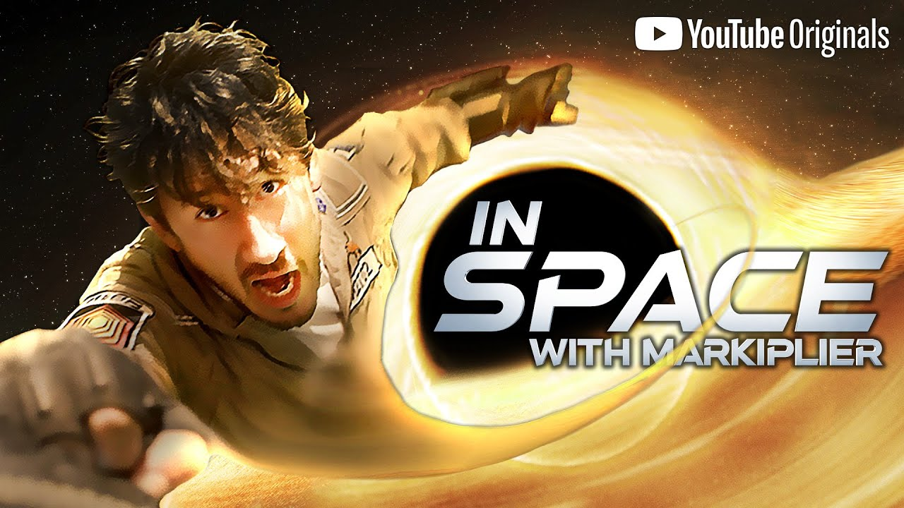

# ISWM W2G
ISWM W2G is an unofficial [In Space With Markiplier](https://youtu.be/j64oZLF443g) viewing world for VRChat.

The world utilizes an [USharp Video](https://github.com/MerlinVR/USharpVideo) being controlled by a custom written controller. 

All of the decisions and paths in the show are precached in-world then loaded dynamically using VRChat's provided Udon JSON libraries. 

All content is streamed by video streaming libraries built into VRChat.

## How It Works
To the untrained eye; it looks like either a fan project or a cheap clout grab. 
But to the trained eye it seems like this shouldn't exist, and it almost *didn't* exist at all.

For context [In Space With Markiplier](https://youtu.be/j64oZLF443g) is a free YouTube Original comedy adventure show that features an *interactive branching storyline*. The show uses the platform universal YouTube Cards to enable the viewer(s) to make active decisions in the narrative making choices as their own character, "The Captain", in the show.

Well that's interesting, but what if I want to watch it with my friends across the globe in VRChat? Well... as of making this world and as of writing this months after the fact; **VRChat's video player system does not support YouTube Cards or metadata in any capacity.** No thumbnails, no descriptions.

Worst of all, VRChat's web query system doesn't support procedurally generated dynamic web requesting. All web requests must either be manually inserted by a user at runtime or permanently baked in-full into the world by the developer.

In order for this show to work at all in VRChat, I had to make a custom solution from scratch.

### So I made custom solution from scratch.
First, I needed to build a database. So using [NodeJS](https://nodejs.org/en) running [YT-DLP](https://github.com/yt-dlp/yt-dlp) commands, I wrote a simple webcrawler to dynamically crawl the entirety of the show from start to finish, visiting every possible choice on every possible path, and building a non-linear linked list of the entire decision tree of the show (approximately 97 unique videos) and exporting it as a JSON file. Every node contained the title of the video, it's description, and it's unique ID and link.

After some manual data integrity checking and cleanup, I used a second webcrawler to pre-download all the thumbnails of every video in the show so they could be baked into the VRChat world.

After that I built a custom [UdonSharp](https://udonsharp.docs.vrchat.com/) (modified Unity C# for VRChat) state machine that was capable of now tokenizing and navigating the decision tree linked-list at runtime in the VRChat Client while displaying fake YouTube cards onscreen for users to vote on and navigate the show. The state machine can pull the IDs of a particular video's choices and look up the thumbnails, and titles, by their ID and displaying them onscreen in the cards. There are also multiple sets of cards in configuration of 1-4 the state machine picks from to display the choices.

But of course, VRChat's web query system can't dynamically load links that aren't baked into a world. But inks must be wrapped in a [`VRCURL`](https://creators.vrchat.com/worlds/udon/external-urls/#vrcurl) container, *who's constructor only exists in the Unity Editor*. So I wrote a custom editor that will take a reference to the JSON file and with a button press creates and prefills an array with `VRCURL`s for every video in the show. That array then gets baked into the world and accessed by the controller at runtime to feed the video URLs into the player.